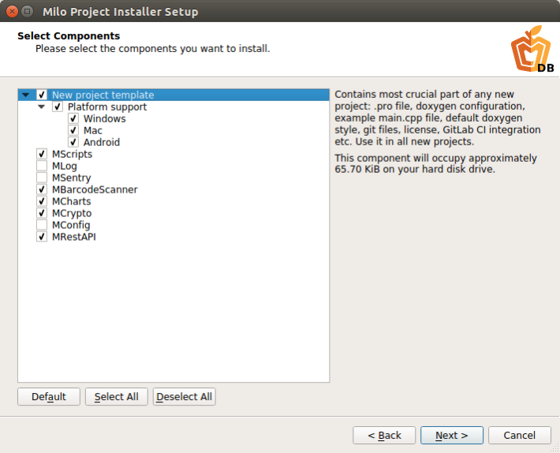

**WARNING: MCDB Installer has now moved to https://github.com/milosolutions/milo-qtcreator-wizard and works as a Qt Creator Wizard**

[TOC]

Full documentation is available online - check it out [here](https://docs.milosolutions.com/milo-code-db/main).

Source code: [GitHub](https://github.com/milosolutions)



# Intro

Milo Code Database is the place where we keep all useful pieces of code:
snippets, working modules, templates. The repository is organised into a Qt
Installer Framework project. MCDB is a great way to skip all the mundane and
boring code you have to write for each new project - here you get all the
initial project code prepared and ready for further development.

If you need some mobule for an existing project, see \ref subprojects. That page
also contains links to online documentation.

If you are creating a new project, you are encouraged to check our MCDB
installers. See the following sections for more details.

# Subprojects

Subproject documentation is listed [here](\ref subprojects).

# Prebuilt installers

You can find prebuilt installers of Milo Code Database on our
[Seafile](https://seafile.milosolutions.com/d/2c50614e1e/).

The installer is the quickest way to create a new project: with all
necessary boilerplate code in place. The .pro file, doxygen, logger, build
helpers, CI scripts, config classes... everything you choose to install
(the process is customizable) will be extracted to a single place - all
that is left for you is to open it up in Qt Creator and start coding the
interesting bits!

# Using MCDB

Milo Code DB can be used in 2 main ways:

1. Use the MCDB installer to set up a new project. Add any modules you will need.
2. Use MCDB modules in an existing project: either by copying the code or adding
them as git submodules.

Each MCDB submodule contains a readme file and doxygen documentation, so refer
to them for more info. All docs are also available
[online](https://docs.milosolutions.com/milo-code-db/main/subprojects.html).

## Starting from installer

If you are installing template project using Installer, go to
[Seafile](https://seafile.milosolutions.com/d/2c50614e1e/) and download the
newest installer for your platform.

Run it (you may need to set the executable permission on Linux) and  choose the
name for your project. This name will be used for folder name, your .pro file,
target application name etc. so choose wisely.


Choosing project name


Next step is choosing the installation directory. Here setup will create a new
folder with your (reviously chosen) project name, and copy all installation
files into it.

If you select "Add git repository", the installer will run ```git init``` in
the project directory after installation. You can also choose to create the
initial commit with all the installed files. Lastly, you can specify remote
repository (on GitLab or GitHub for example) and the installer will set it up
for you as a *git remote* (origin). All git options are completely optional.


Choosing installation directory


On the following screen you get to choose the Milo Code Database modules you
want to use in your project. All modules will be automatically added to your
.pro file - after installation the project will be ready to be used, either
with raw qmake or with Qt Creator.


Choosing MCDB modules


Following are standard installation steps: license confirmation, installation
progress and summary.

When the installation is ready, you can open the .pro file (located in
_installation dir_/_project name_/_project name_.pro) in Qt Creator and start
coding. See the README.md located in your newly installed project for further
instructions.

## Using in existing project

You can also easily add MCDB modules to an existing Qt project. All that is
required is to:

1. Get the module source code (either copy it, or include as git submodule).
2. Add the module's .pri file to your main .pro.
3. You're ready!

# Developing MCDB

## Building installer

Instructions for building MCDB installer are listed
[here](\ref buildinginstaller).

## Documentation branding

Information how to apply Milo branding to doxygen docs is available in
[Documentation branding](\ref docbranding).

## Requirements for new modules

Each separate piece of technology we share should be kept in a separate git
repository, and imported to DB using git submodule add. Milo Code Database
is only acting as a "home" to them all (mcdb-installer repository).

All code has to be properly licensed, documented, contain readme and doxygen
docs. More information about adding new modules is available in
[Repository guide](\ref repositoryguide).

# License

This project is licensed under the MIT License - see the LICENSE-MiloCodeDB.txt
file for details

# Further reading 

Checkout instructions are contained in \ref repositoryguide This document also
contains hints on how to efficiently (and correctly) use this meta-repository
and all submodules.
